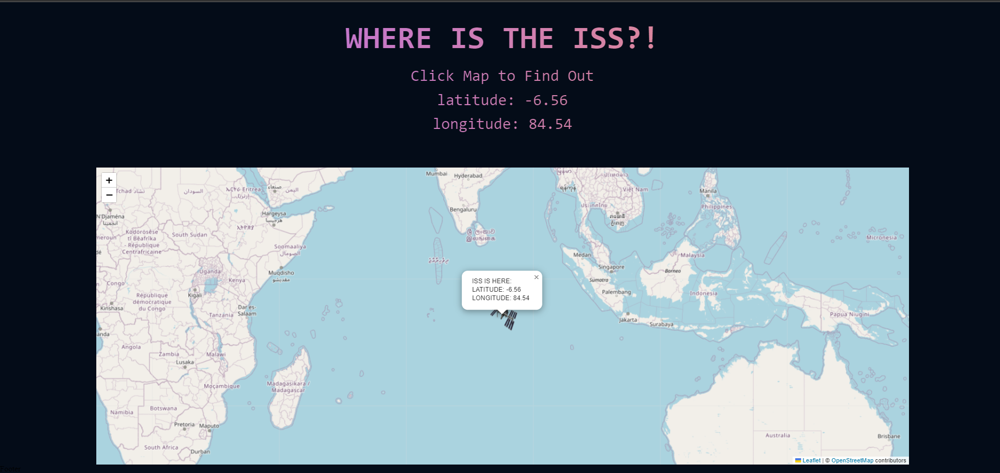
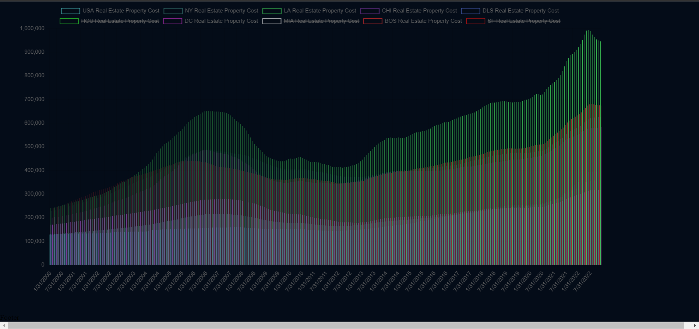

# CHARTING

## Dashboard App

The goal of this project was create a user friendly page that connect to a few other projects. This was created over a weekend where I was able to experiement with leaflet.js and a few api's such as coinranking and a real estate api to graph average cost of homes.

###

This feel free to fork, clone, npm install locally and check it out for yourself! The big parts of this were making sure the landing viewport page was looking good along with the dashboard links below, on scroll

###

The goal of this "dashboard" is to keep experimenting with different technologies and keep the ones that stick.

## Sample

